# VoteEase - Spring Boot Voting System

VoteEase is a complete online voting system built with **Spring Boot** and **Thymeleaf**, featuring integrated server-side rendering with robust security and real-time functionality.

## 🚀 Features

- **User Authentication** (Session-based security)
- **Role-based Access Control** (Candidate, Voter, Admin, Election guider)
- **Secure Voting System** (Prevent duplicate votes)
- **Real-time Vote Counting** (Thymeleaf live updates)
- **Audit Logs & Data Integrity**
- **Template-driven UI** (Server-side rendered views)

## 🏗️ Tech Stack

### **Server Components**

- **Spring Boot** - Core application framework
- **Thymeleaf** - Server-side templating engine
- **Spring Security** - Authentication & authorization
- **Spring Data JPA (Hibernate)** - Database ORM layer
- **PostgreSQL** - Persistent data storage
- **Lombok** - Boilerplate reduction

### UI Layer

- **Bootstrap 5** - Responsive frontend components
- **Thymeleaf Fragments** - Reusable UI templates
- **Spring MVC** - Controller-driven views
- **Form Binding** - Thymeleaf + Spring validation

### Prerequisites

- Java 17+
- Maven
- PostgreSQL

## Resources used

- [Spring Security](https://www.youtube.com/watch?v=X7pGCmVxx10&t=689s)

## 📸 Application Workflow (Screenshots)

### 🏠 Main Page

> Homepage with navigation and basic description  
> 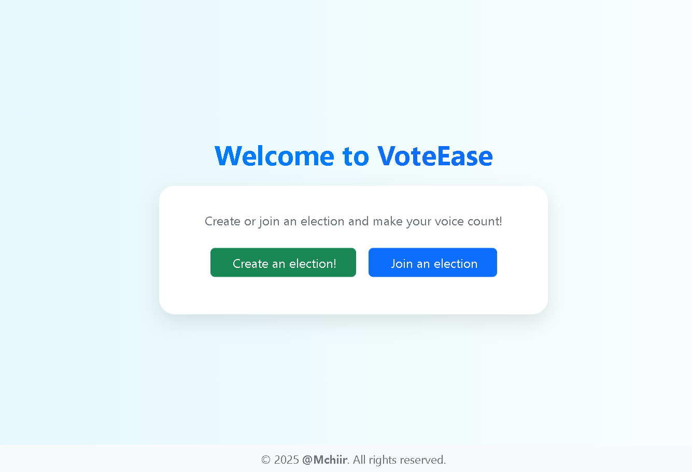

---

### 🧑‍💼 Election Creator Flow

1. **Login Page**  
   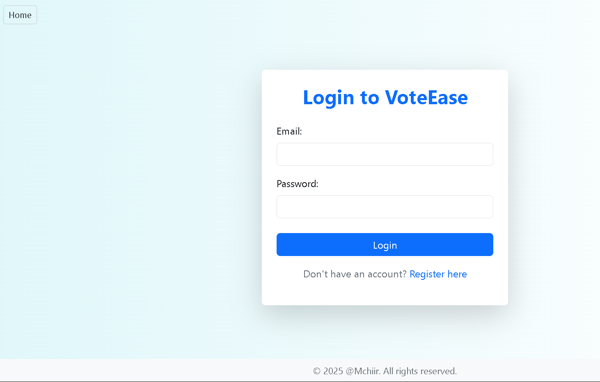

2. **Register Page**  
   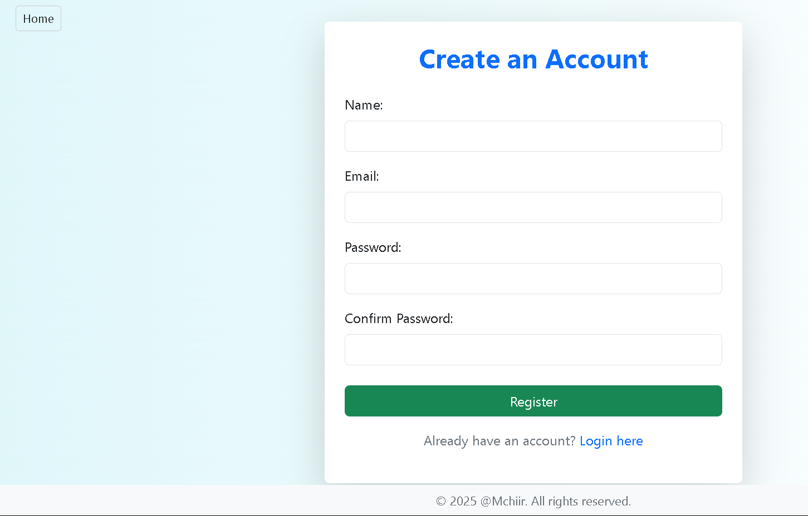

3. **Dashboard (Created Elections)**  
   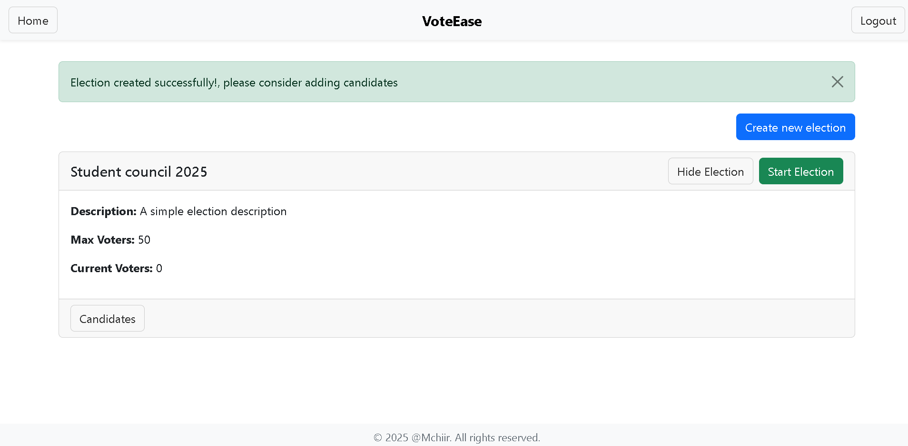

4. **Create New Election (Step 1)**  
   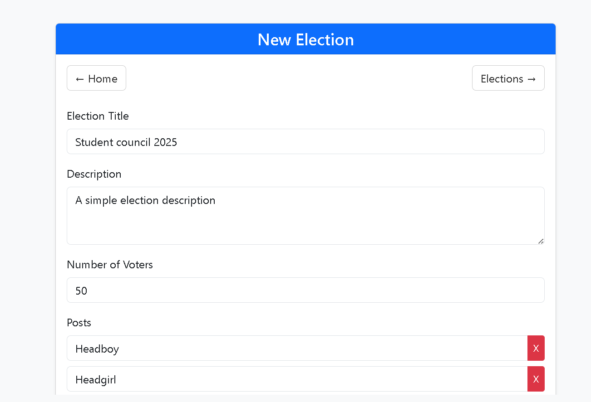

5. **Create New Election (Step 2)**  
   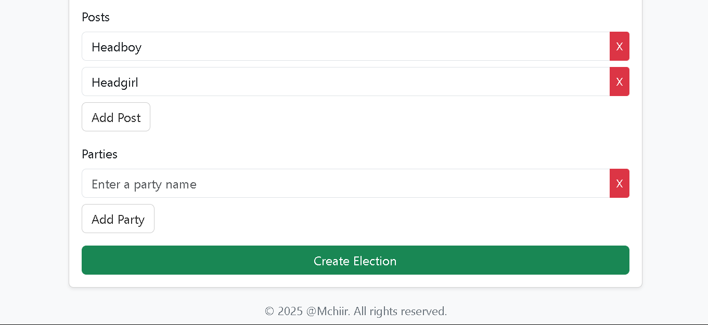

6. **Add Candidates (Step 1)**  
   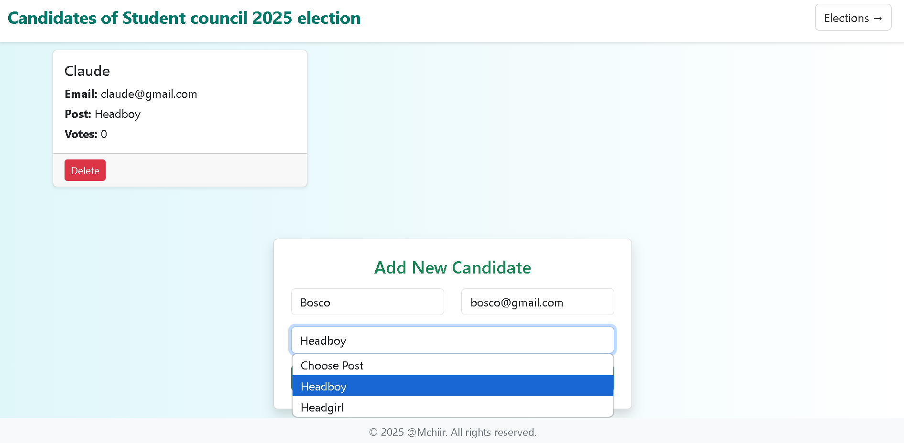

7. **Add Candidates (Step 2)**  
   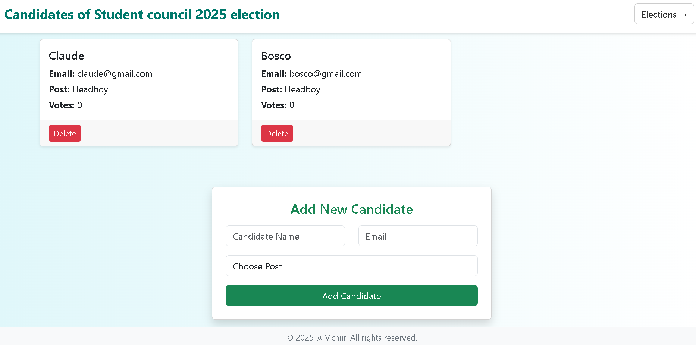

8. **Start Election (Get Code)**  
   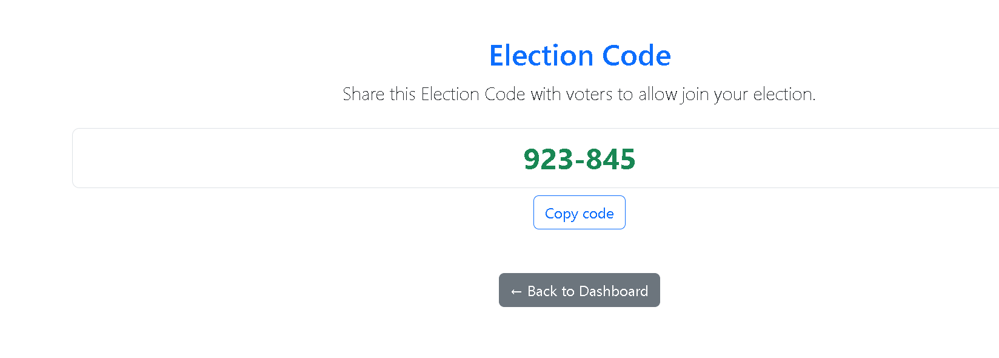

9. **End Election**  
   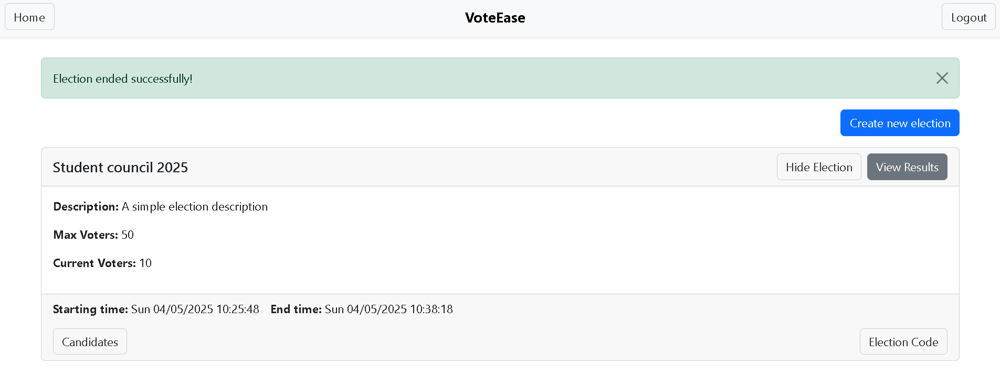

10. **View Election Results**  
    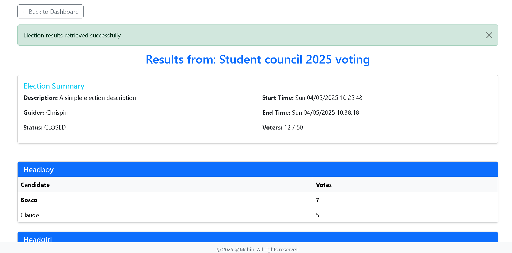

---

### 🗳️ Election Voter Flow

1. **Voter Dashboard**  
   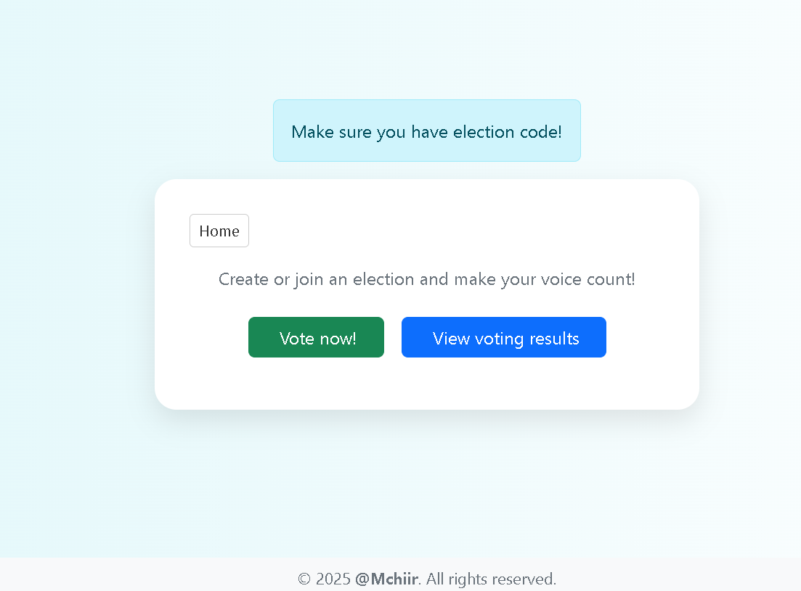

2. **Get Voting Code**  
   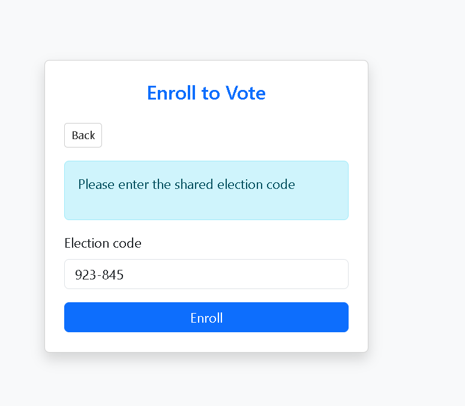

3. **Voting Page**  
   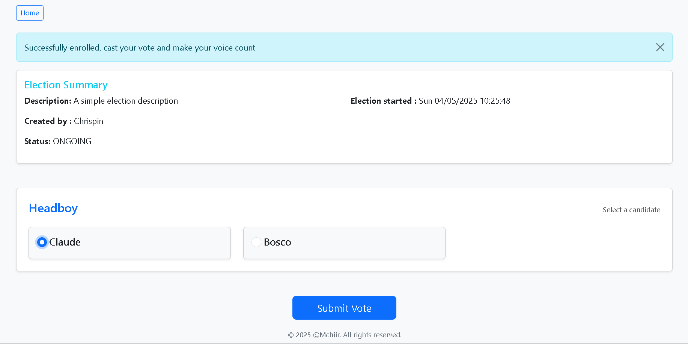

4. **Vote Confirmation**  
   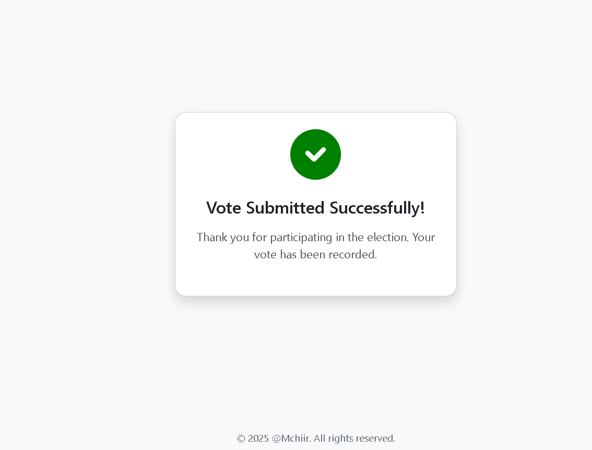

5. **Request Results**  
   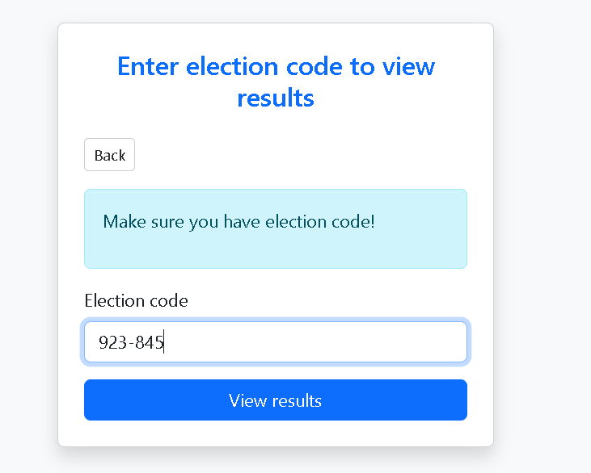

6. **Election Results Page**  
   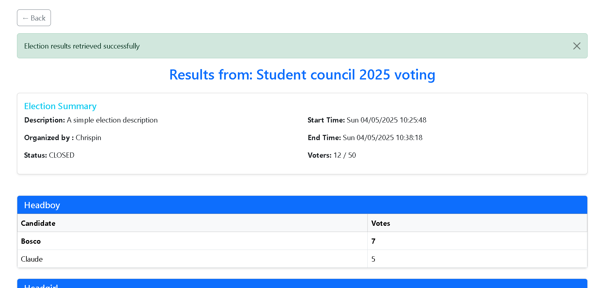

---

## 📜 License

MIT License - Feel free to contribute and make Pull Request!

## ✉️ Contact

For any issues, reach out via **[GitHub Issues](https://github.com/Mchiir/voteEase/issues)** or Email **mugishachrispin590@gmail.com**.

---

🚀 **Happy Coding & Secure Voting!** 🗳️
